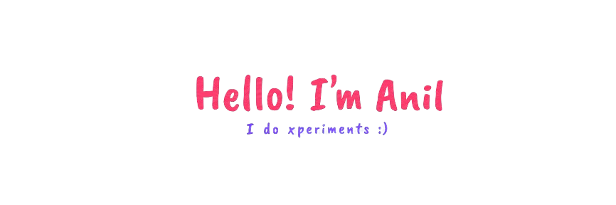

  

## About Me

I'm an **Electronics and Communication Engineering** student who found my way between the core and software worlds — so I chose **Embedded Systems**. :)

I like working close to the hardware while still getting to write software, experiment with ideas, and make things work.

## Embedded Systems 🐇

  

Currently learning and experimenting with:

* **CAN Communication**
* **APIs**
* **CLI**
* Embedded software & hardware

## How I Code

I'm a bit of a **vibe coder**.

I don't just code — **I ask for the code.**
Then I figure out what it does, break it, fix it, and learn from it.

  

## My Philosophy

**I build, learn, improve things.**

## Ask Me

Want to talk about a project, embedded systems, random experiments, or just have an idea you want to build?

  

**[anilgowd42637@gmail.com](mailto:anilgowd42637@gmail.com)**

---

  Still experimenting. Still learning. Still building.

