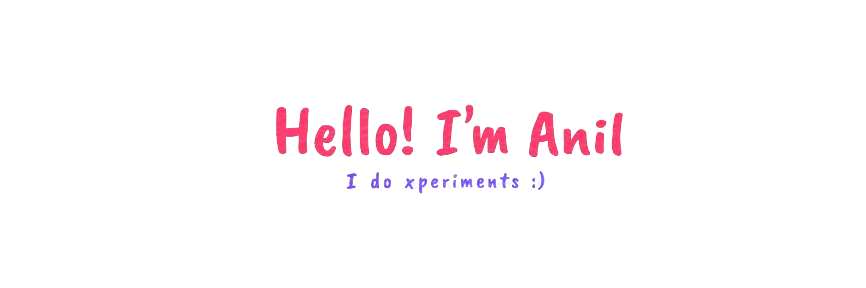

  

 

<h3>About Me</h3>

I'm an **Electronics and Communication Engineering** student who found myself somewhere between the core and software worlds — so I chose **Embedded Systems**.

I like being close to the hardware while still getting to write software, experiment with ideas, and make things work.

 

<table border="0" cellpadding="0" cellspacing="0">
<tr>
<td valign="middle">

Currently learning and experimenting with:

* **CAN Communication**
* **APIs**
* **CLI**

</td>
<td width="40"></td>
<td valign="middle">

</td>
</tr>
</table>

 

<h3>Hobbies</h3>

<table border="0" cellpadding="0" cellspacing="0">
<tr>
<td valign="middle">

I build, learn, improve things.

Sometimes they work.
If they don't, they will!!!

</td>
<td width="40"></td>
<td valign="middle">

</td>
</tr>
</table>

 

<h3>A Quote I Like</h3>

> **"The most personal is the most creative."**
> — Martin Scorsese

 

  Still experimenting. Still learning. Still building.

